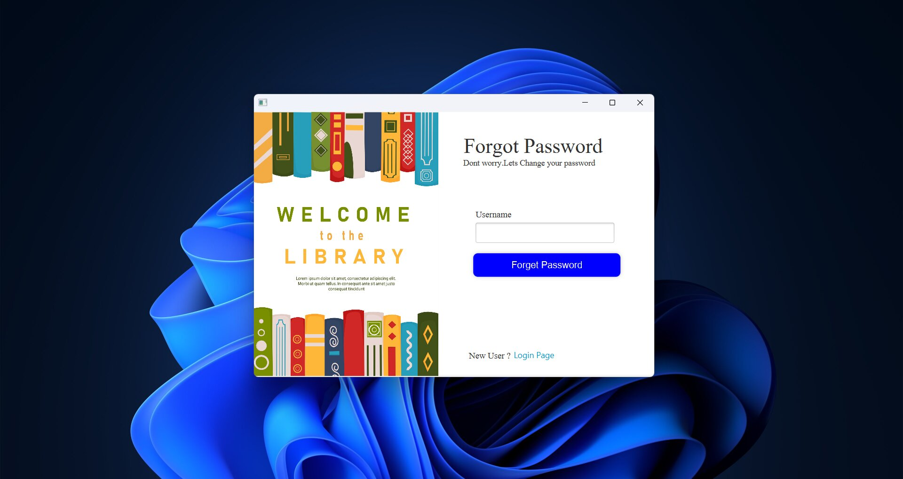
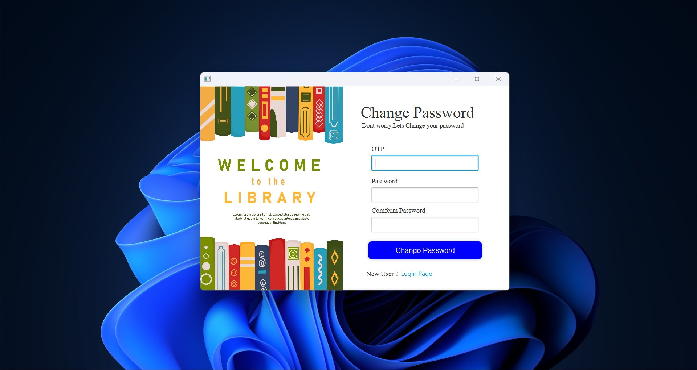
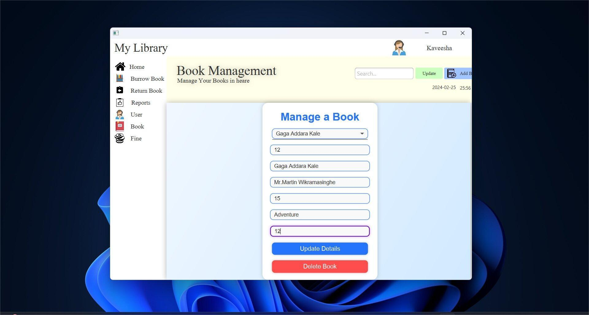
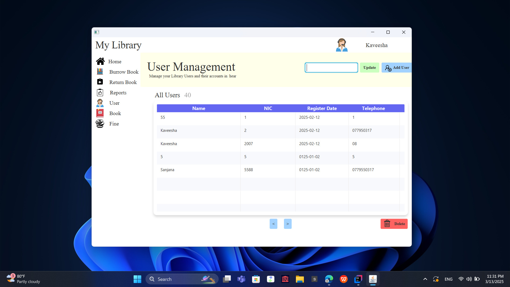
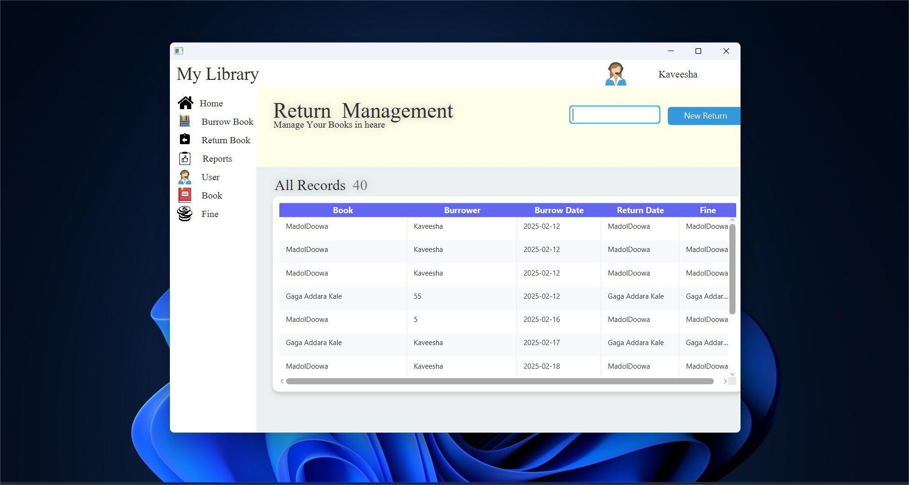
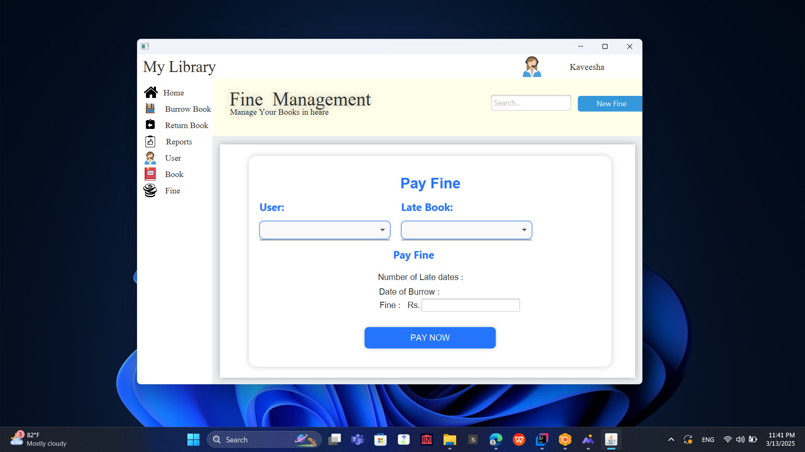
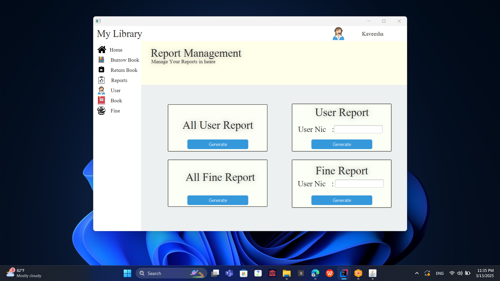

# Library Management System (JavaFX)

This **Library Management System** is built with **JavaFX**, designed to efficiently handle book borrowing, returns, fines, and user management with full **CRUD** operations.

## 🚀 Features
- 📧 **Forgot Password OTP** – Secure **JavaMail-based OTP** system for password resets.  
  
  
- 📚 **Book Management** – Add, update, delete, and view books.  
  
- 👤 **User & Customer Management** – Full CRUD operations for customers and system users.  
  
- 🔄 **Borrow & Return Management** – Add, update, delete, and view borrowed books and returns.  
  
  
- 💰 **Fine Management** –  operations for calculating, deleting late return fines.  
  
- 📑 **Generate Reports** – Use **JasperReports** to create book borrowing reports.  
  

- 🏗️ **Layered Architecture** – Well-structured, modular code for maintainability.  
- 🛢️ **Hybrid Database Approach** – Uses **Hibernate** with custom **MySQL queries**.  

## 🛠️ Tech Stack
- **JavaFX** for UI  
- **Hibernate & MySQL** for data management  
- **JasperReports** for reporting  
- **JavaMail** for email services  
- **CSS** for UI customization  

## 📦 Installation & Setup

1. **Clone the repository:**  
   ```sh
   git clone https://github.com/your-username/library-management-system.git
   ```

2. **Open the project in your preferred IDE (IntelliJ IDEA, Eclipse, NetBeans, etc.).**

3. **Set up the database:**  
   - Create a MySQL database.
   - Import the provided database schema (`database.sql`).
   - Update database connection settings in `hibernate.cfg.xml`.

4. **Configure Email for OTP Service:**  
   - Update SMTP settings in the project configuration.

5. **Run the Application:**  
   - Compile and run the JavaFX application.

## 📜 License
This project is open-source and available under the **MIT License**.

## 📬 Contact
For any issues or feature requests, feel free to open an issue or contact me at kavishasanjana22@gmail.com.
